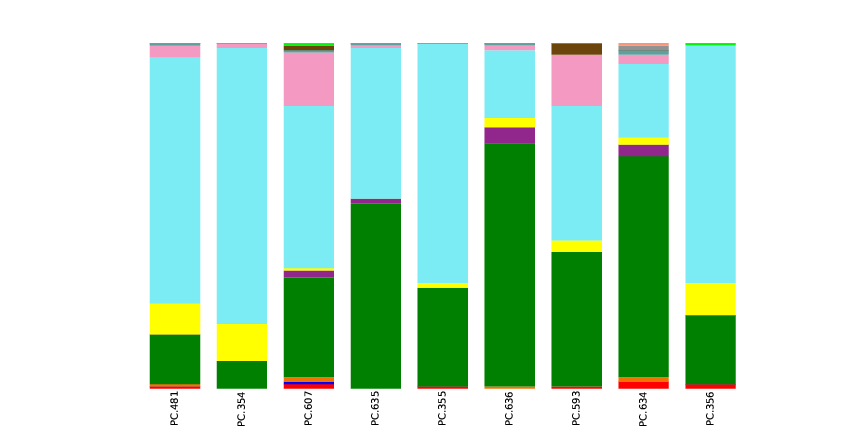
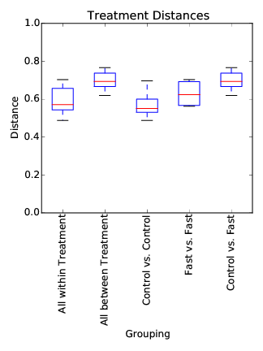

```{r set_knitr_options, echo=FALSE, message=FALSE}
suppressMessages(library(knitr))
opts_chunk$set(tidy=FALSE, cache=FALSE, echo=TRUE, message=FALSE)
```

## Qiime Overview Tutorial Run From RStudio

Run the commands listed in "Qiime Overview Tutorial" from within RStudio.

Tested on Ubuntu 14 (Biolinux 8). Has not been tested on any other platform.

Based on:

* [Werner Lab Qiime Overview Tutorial](http://www.wernerlab.org/teaching/qiime/overview)
* [Qiime.org Qiime Tutorial](http://qiime.org/tutorials/tutorial.html)

The source for this version of the tutorial was written as an RMarkdown (Rmd) 
file and was processed with `knitr` to produce HTML, PDF, or MS-Word DOCX outputs.

Note: If you are running this in a RStudio Server environment, without access
to a remote graphical desktop environment, then run the `tut.sh` script first, 
in such an environment (e.g., via X2Go), as some commands require this environment 
(i.e., an X server) to run.

```{r, engine='bash', echo=FALSE, eval=FALSE}
# Test Qiime Environment
print_qiime_config.py -tf
```

## Get the data

Download and extract the data archive, if this has not already been done.

```{r, engine='bash'}
if [ ! -d qiime_overview_tutorial ]; then \
    if [ ! -f qiime_overview_tutorial.zip ]; then \
        wget -q 'ftp://ftp.microbio.me/pub/qiime-files/qiime_overview_tutorial.zip'
    fi
    unzip -q -o qiime_overview_tutorial.zip
fi

# Make images folder for output
mkdir -p images

# Enter the data folder.
cd qiime_overview_tutorial
```

```{r, warning=FALSE, echo=FALSE}
# Change the working directory
setwd("qiime_overview_tutorial")
opts_knit$set(root.dir = getwd())
```

## Examine the data files

View the first record (6 lines) in `Fasting_Example.fna`.

```{r, engine='bash'}
head -6 Fasting_Example.fna
```

Count the number of records in `Fasting_Example.fna`.

```{r, engine='bash'}
grep -c ">" Fasting_Example.fna
```

View the first record (6 lines) in `Fasting_Example.qual`.

```{r, engine='bash'}
head -6 Fasting_Example.qual
```

Count the number of records in `Fasting_Example.qual`.

```{r, engine='bash'}
grep -c ">" Fasting_Example.qual
```

View the `Fasting_Map.txt` file.

```{r, engine='bash'}
cat Fasting_Map.txt 
```

## Trim the barcodes

```{r, engine='bash'}
split_libraries.py -m Fasting_Map.txt -f Fasting_Example.fna -q Fasting_Example.qual -o split_library_output/
```

View the folder which was created.

```{r, engine='bash'}
ls -lh split_library_output/
```

View the logfile.

```{r, engine='bash'}
cat split_library_output/split_library_log.txt
```

View the first record (2 lines) in `split_library_output/seqs.fna`.

```{r, engine='bash'}
head -2 split_library_output/seqs.fna
```

## Denoise

```{r, engine='bash'}
if [ ! -d denoiser ]; then \
    # This might take up to an hour to run...
    denoise_wrapper.py -i Fasting_Example.sff.txt -f split_library_output/seqs.fna -m Fasting_Map.txt -o denoiser/
fi

inflate_denoiser_output.py -c denoiser/centroids.fasta -s denoiser/singletons.fasta -f split_library_output/seqs.fna -d denoiser/denoiser_mapping.txt -o inflated_denoised_seqs.fna
```

```{r, engine='bash'}
head inflated_denoised_seqs.fna
```

## Pick OTUs

```{r, engine='bash'}
pick_otus.py -i inflated_denoised_seqs.fna
```

View the first 10 lines of `inflated_denoised_seqs_otus.txt`.

```{r, engine='bash'}
head uclust_picked_otus/inflated_denoised_seqs_otus.txt
```

Pick one representative sequence per OTU.

```{r, engine='bash'}
pick_rep_set.py -i uclust_picked_otus/inflated_denoised_seqs_otus.txt -f inflated_denoised_seqs.fna -o rep_set.fna
```

Count number of sequences in resulting FASTA file.

```{r, engine='bash'}
grep -c ">" rep_set.fna
```

View first two records (4 lines) of the `rep_set.fna` file.

```{r, engine='bash'}
head -4 rep_set.fna
```

## Assign Taxonomy

```{r, engine='bash'}
if [ ! -d taxonomy_results ]; then \
    assign_taxonomy.py -i rep_set.fna -o taxonomy_results/
fi
```

## Build OTU Table

```{r, engine='bash'}
make_otu_table.py -i uclust_picked_otus/inflated_denoised_seqs_otus.txt -t taxonomy_results/rep_set_tax_assignments.txt -o otu_table.biom
```

Convert to text format.

```{r, engine='bash'}
biom convert -i otu_table.biom -o otu_table_tabseparated.txt --to-tsv --header-key taxonomy --output-metadata-id "ConsensusLineage"
```

View the first 10 lines of `otu_table_tabseparated.txt`.

```{r, engine='bash'}
head otu_table_tabseparated.txt
```

## Summarize Taxonomy

Note: These commands need to run with access to a graphical display.

```{r, engine='bash', eval=FALSE}
summarize_taxa.py -i otu_table.biom -o taxonomy_summaries/
```

Make html reports containing plots.

```{r, engine='bash', eval=FALSE}
plot_taxa_summary.py -i taxonomy_summaries/otu_table_L3.txt -o taxonomy_plot_L3/
```

```{r, echo=FALSE, eval=FALSE}
# Extract the name of the PNG file from the HTML file and copy the PNG to "images".

require(XML)

png.file <- getHTMLExternalFiles(
    'taxonomy_plot_L3/bar_charts.html', 
    xpQuery = c("//img/@src"))

png.path <- file.path('taxonomy_plot_L3', png.file)

if (file.exists(png.path)) {
    file.copy(png.path, file.path('..', 'images', 'taxonomy_plot_L3_bar.png'))
}
```



## Make a Multiple Sequence Alignment

```{r, engine='bash'}
if [ ! -d alignment ]; then \
    align_seqs.py -i rep_set.fna -o alignment/
fi
```

Filter the alignment to aid the building of phylogenetic tree.

```{r, engine='bash'}
filter_alignment.py -i alignment/rep_set_aligned.fasta -o alignment/
```

## Build a phylogenetic tree

```{r, engine='bash'}
make_phylogeny.py -i alignment/rep_set_aligned_pfiltered.fasta -o rep_set_tree.tre
```

## Perform Multiple Rarefactions

```{r, engine='bash'}
multiple_rarefactions.py -i otu_table.biom -m 20 -x 100 -s 20 -n 10 -o rare_20-100/
```

## Calculate Alpha Diversity

```{r, engine='bash'}
if [ ! -d alpha_rare ]; then \
    alpha_diversity.py -i rare_20-100/ -o alpha_rare/ -t rep_set_tree.tre -m observed_species,chao1,PD_whole_tree
fi
```

## Summarize the Alpha Diversity Data

```{r, engine='bash'}
if [ ! -d alpha_collated ]; then \
    collate_alpha.py -i alpha_rare/ -o alpha_collated/
fi
```

## Jackknifed beta diversity analysis

```{r, engine='bash'}
if [ ! -d jackknifed_beta_diversity ]; then \
    jackknifed_beta_diversity.py -i otu_table.biom -o jackknifed_beta_diversity/ -e 90 -m Fasting_Map.txt -t rep_set_tree.tre
fi
```

## Distance Statistics

```{r, engine='bash'}
dissimilarity_mtx_stats.py -i jackknifed_beta_diversity/unweighted_unifrac/rare_dm/ -o unweighted_unifrac_stats/
```

## Make Distance Boxplots

Note: These commands need to run with access to a graphical display.

```{r, engine='bash', eval=FALSE}
make_distance_boxplots.py -m Fasting_Map.txt -o distance_boxplots -d unweighted_unifrac_stats/means.txt -f Treatment --save_raw_data
```

Convert PDF to PNG.

```{r, engine='bash', eval=FALSE}
convert distance_boxplots/Treatment_Distances.pdf distance_boxplots/Treatment_Distances.png
```

```{r, echo=FALSE, eval=FALSE}
# Copy the PNG to "images".
dist.boxplot <- file.path('distance_boxplots', 'Treatment_Distances.png')
if (file.exists(dist.boxplot)) {
    file.copy(dist.boxplot, file.path('..', 'images', 'Treatment_Distances.png'))
}
```

