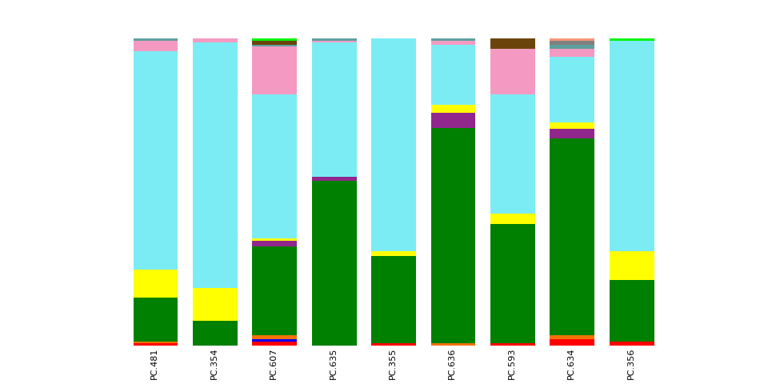
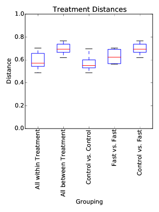

# Qiime Tutorial
Brian High  


## Qiime Overview Tutorial Run From RStudio

Run the commands listed in "Qiime Overview Tutorial" from within RStudio.

Tested on Ubuntu 14 (Biolinux 8). Has not been tested on any other platform.

Based on:

* [Werner Lab Qiime Overview Tutorial](http://www.wernerlab.org/teaching/qiime/overview)
* [Qiime.org Qiime Tutorial](http://qiime.org/tutorials/tutorial.html)

The source for this version of the tutorial was written as an RMarkdown (Rmd) 
file and was processed with `knitr` to produce HTML, PDF, or MS-Word DOCX outputs.

Note: If you are running this in a RStudio Server environment, without access
to a remote graphical desktop environment, then run the `tut.sh` script first, 
in such an environment (e.g., via X2Go), as some commands require this environment 
(i.e., an X server) to run.


## Get the data

Download and extract the data archive, if this has not already been done.


```bash
if [ ! -d qiime_overview_tutorial ]; then \
    if [ ! -f qiime_overview_tutorial.zip ]; then \
        wget -q 'ftp://ftp.microbio.me/pub/qiime-files/qiime_overview_tutorial.zip'
    fi
    unzip -q -o qiime_overview_tutorial.zip
fi

# Make images folder for output
mkdir -p images

# Enter the data folder.
cd qiime_overview_tutorial
```


## Examine the data files

View the first record (6 lines) in `Fasting_Example.fna`.


```bash
head -6 Fasting_Example.fna
```

```
## >FLP3FBN01ELBSX length=250 xy=1766_0111 region=1 run=R_2008_12_09_13_51_01_
## ACAGAGTCGGCTCATGCTGCCTCCCGTAGGAGTCTGGGCCGTGTCTCAGTCCCAATGTGG
## CCGTTTACCCTCTCAGGCCGGCTACGCATCATCGCCTTGGTGGGCCGTTACCTCACCAAC
## TAGCTAATGCGCCGCAGGTCCATCCATGTTCACGCCTTGATGGGCGCTTTAATATACTGA
## GCATGCGCTCTGTATACCTATCCGGTTTTAGCTACCGTTTCCAGCAGTTATCCCGGACAC
## ATGGGCTAGG
```

Count the number of records in `Fasting_Example.fna`.


```bash
grep -c ">" Fasting_Example.fna
```

```
## 1339
```

View the first record (6 lines) in `Fasting_Example.qual`.


```bash
head -6 Fasting_Example.qual
```

```
## >FLP3FBN01ELBSX length=250 xy=1766_0111 region=1 run=R_2008_12_09_13_51_01_
## 37 37 37 37 37 37 37 37 37 37 37 37 37 37 37 37 37 37 37 37 36 36 33 33 33 36 37 37 37 37 37 37 40 40 40 39 39 38 40 40 40 40 40 40 40 37 37 37 37 37 35 35 35 37 37 37 37 37 35 35
## 35 31 31 23 23 23 31 21 21 21 35 35 37 37 37 36 36 36 36 36 36 37 37 37 37 37 37 37 37 37 37 37 37 37 37 37 37 37 37 37 37 28 28 28 36 36 37 37 37 37 37 37 37 37 37 37 37 37 37 37
## 37 37 37 37 37 37 37 37 37 37 37 37 37 37 37 37 36 36 36 37 37 37 37 37 37 37 37 37 37 37 37 36 36 36 37 37 37 37 37 37 37 37 37 37 37 37 37 37 37 37 35 32 32 32 32 35 37 37 37 37
## 37 37 37 37 37 37 37 37 37 37 37 37 37 37 36 32 32 32 36 37 35 32 32 32 32 32 32 32 32 36 37 37 37 37 36 36 31 31 32 32 36 36 36 36 36 36 36 36 36 36 36 28 27 27 27 26 26 26 30 29
## 30 29 24 24 24 21 15 15 13 13
```

Count the number of records in `Fasting_Example.qual`.


```bash
grep -c ">" Fasting_Example.qual
```

```
## 1339
```

View the `Fasting_Map.txt` file.


```bash
cat Fasting_Map.txt 
```

```
## #SampleID	BarcodeSequence	LinkerPrimerSequence	Treatment	DOB	Description
## #Example mapping file for the QIIME analysis package.  These 9 samples are from a study of the effects of exercise and diet on mouse cardiac physiology (Crawford, et al, PNAS, 2009).
## PC.354	AGCACGAGCCTA	YATGCTGCCTCCCGTAGGAGT	Control	20061218	Control_mouse_I.D._354
## PC.355	AACTCGTCGATG	YATGCTGCCTCCCGTAGGAGT	Control	20061218	Control_mouse_I.D._355
## PC.356	ACAGACCACTCA	YATGCTGCCTCCCGTAGGAGT	Control	20061126	Control_mouse_I.D._356
## PC.481	ACCAGCGACTAG	YATGCTGCCTCCCGTAGGAGT	Control	20070314	Control_mouse_I.D._481
## PC.593	AGCAGCACTTGT	YATGCTGCCTCCCGTAGGAGT	Control	20071210	Control_mouse_I.D._593
## PC.607	AACTGTGCGTAC	YATGCTGCCTCCCGTAGGAGT	Fast	20071112	Fasting_mouse_I.D._607
## PC.634	ACAGAGTCGGCT	YATGCTGCCTCCCGTAGGAGT	Fast	20080116	Fasting_mouse_I.D._634
## PC.635	ACCGCAGAGTCA	YATGCTGCCTCCCGTAGGAGT	Fast	20080116	Fasting_mouse_I.D._635
## PC.636	ACGGTGAGTGTC	YATGCTGCCTCCCGTAGGAGT	Fast	20080116	Fasting_mouse_I.D._636
```

## Trim the barcodes


```bash
split_libraries.py -m Fasting_Map.txt -f Fasting_Example.fna -q Fasting_Example.qual -o split_library_output/
```

View the folder which was created.


```bash
ls -lh split_library_output/
```

```
## total 420K
## -rw-r--r-- 1 high netid_users  317 Aug 31 17:54 histograms.txt
## -rw-r--r-- 1 high netid_users 409K Aug 31 17:54 seqs.fna
## -rw-r--r-- 1 high netid_users 1.2K Aug 31 17:54 split_library_log.txt
```

View the logfile.


```bash
cat split_library_output/split_library_log.txt
```

```
## Number raw input seqs	1339
## 
## Length outside bounds of 200 and 1000	0
## Num ambiguous bases exceeds limit of 6	0
## Missing Qual Score	0
## Mean qual score below minimum of 25	1
## Max homopolymer run exceeds limit of 6	0
## Num mismatches in primer exceeds limit of 0: 1
## 
## Sequence length details for all sequences passing quality filters:
## Raw len min/max/avg	233.0/293.0/265.8
## Wrote len min/max/avg	200.0/260.0/232.8
## 
## Barcodes corrected/not	0/0
## Uncorrected barcodes will not be written to the output fasta file.
## Corrected barcodes will be written with the appropriate barcode category.
## Corrected but unassigned sequences will not be written unless --retain_unassigned_reads is enabled.
## 
## Total valid barcodes that are not in mapping file	0
## Sequences associated with valid barcodes that are not in the mapping file will not be written.
## 
## Barcodes in mapping file
## Num Samples	9
## Sample ct min/max/mean: 146 / 150 / 148.56
## Sample	Sequence Count	Barcode
## PC.634	150	ACAGAGTCGGCT
## PC.356	150	ACAGACCACTCA
## PC.593	149	AGCAGCACTTGT
## PC.354	149	AGCACGAGCCTA
## PC.635	149	ACCGCAGAGTCA
## PC.607	149	AACTGTGCGTAC
## PC.636	148	ACGGTGAGTGTC
## PC.355	147	AACTCGTCGATG
## PC.481	146	ACCAGCGACTAG
## 
## Total number seqs written	1337
```

View the first record (2 lines) in `split_library_output/seqs.fna`.


```bash
head -2 split_library_output/seqs.fna
```

```
## >PC.634_1 FLP3FBN01ELBSX orig_bc=ACAGAGTCGGCT new_bc=ACAGAGTCGGCT bc_diffs=0
## CTGGGCCGTGTCTCAGTCCCAATGTGGCCGTTTACCCTCTCAGGCCGGCTACGCATCATCGCCTTGGTGGGCCGTTACCTCACCAACTAGCTAATGCGCCGCAGGTCCATCCATGTTCACGCCTTGATGGGCGCTTTAATATACTGAGCATGCGCTCTGTATACCTATCCGGTTTTAGCTACCGTTTCCAGCAGTTATCCCGGACACATGGGCTAGG
```

## Denoise


```bash
if [ ! -d denoiser ]; then \
    # This might take up to an hour to run...
    denoise_wrapper.py -i Fasting_Example.sff.txt -f split_library_output/seqs.fna -m Fasting_Map.txt -o denoiser/
fi

inflate_denoiser_output.py -c denoiser/centroids.fasta -s denoiser/singletons.fasta -f split_library_output/seqs.fna -d denoiser/denoiser_mapping.txt -o inflated_denoised_seqs.fna
```


```bash
head inflated_denoised_seqs.fna
```

```
## >PC.481_107 FLP3FBN01B32LN orig_bc=ACCAGCGACTAG new_bc=ACCAGCGACTAG bc_diffs=0
## TTGGGCCGTGTCTCAGTCCCAATGTGGCCGTTCACCCTCTCAGGCCGGCTACTGATCGTCGCCTTGGTGGGCTGTTACCCCGCCAACCAGCTAATCAGACGCGGATCCATCGTATACCACCGGAGTTTTTCACACTGCTTCATGCGAAGCTGTGCGCTTATGCGGTATTAGCACCTATTTCTAAGTGTTATCCCCCAGTATACGGCAGGTTCTCCACGCGTT
## >PC.481_160 FLP3FBN01A6LEJ orig_bc=ACCAGCGACTAG new_bc=ACCAGCGACTAG bc_diffs=0
## TTGGGCCGTGTCTCAGTCCCAATGTGGCCGTTCACCCTCTCAGGCCGGCTACTGATCGTCGCCTTGGTGGGCTGTTACCCCGCCAACCAGCTAATCAGACGCGGATCCATCGTATACCACCGGAGTTTTTCACACTGCTTCATGCGAAGCTGTGCGCTTATGCGGTATTAGCACCTATTTCTAAGTGTTATCCCCCAGTATACGGCAGGTTCTCCACGCGTT
## >PC.481_229 FLP3FBN01ED5UR orig_bc=ACCAGCGACTAG new_bc=ACCAGCGACTAG bc_diffs=0
## TTGGGCCGTGTCTCAGTCCCAATGTGGCCGTTCACCCTCTCAGGCCGGCTACTGATCGTCGCCTTGGTGGGCTGTTACCCCGCCAACCAGCTAATCAGACGCGGATCCATCGTATACCACCGGAGTTTTTCACACTGCTTCATGCGAAGCTGTGCGCTTATGCGGTATTAGCACCTATTTCTAAGTGTTATCCCCCAGTATACGGCAGGTTCTCCACGCGTT
## >PC.481_309 FLP3FBN01DTX5C orig_bc=ACCAGCGACTAG new_bc=ACCAGCGACTAG bc_diffs=0
## TTGGGCCGTGTCTCAGTCCCAATGTGGCCGTTCACCCTCTCAGGCCGGCTACTGATCGTCGCCTTGGTGGGCTGTTACCCCGCCAACCAGCTAATCAGACGCGGATCCATCGTATACCACCGGAGTTTTTCACACTGCTTCATGCGAAGCTGTGCGCTTATGCGGTATTAGCACCTATTTCTAAGTGTTATCCCCCAGTATACGGCAGGTTCTCCACGCGTT
## >PC.355_355 FLP3FBN01BVDVK orig_bc=AACTCGTCGATG new_bc=AACTCGTCGATG bc_diffs=0
## TTGGGCCGTGTCTCAGTCCCAATGTGGCCGTTCACCCTCTCAGGCCGGCTACTGATCGTCGCCTTGGTGGGCTGTTACCCCGCCAACCAGCTAATCAGACGCGGATCCATCGTATACCACCGGAGTTTTTCACACTGCTTCATGCGAAGCTGTGCGCTTATGCGGTATTAGCACCTATTTCTAAGTGTTATCCCCCAGTATACGGCAGGTTCTCCACGCGTT
```

## Pick OTUs


```bash
pick_otus.py -i inflated_denoised_seqs.fna
```

View the first 10 lines of `inflated_denoised_seqs_otus.txt`.


```bash
head uclust_picked_otus/inflated_denoised_seqs_otus.txt
```

```
## denovo0	PC.481_294	PC.354_361	PC.607_480	PC.635_705	PC.355_1121	PC.636_148	PC.636_341	PC.607_350	PC.636_712	PC.607_1088	PC.607_1099	PC.593_1323	PC.634_21	PC.607_97	PC.634_129	PC.607_590	PC.607_886	PC.635_519	PC.636_156	PC.635_308	PC.636_333	PC.607_591	PC.635_640	PC.607_1210	PC.355_731	PC.355_774	PC.481_1169	PC.607_151	PC.635_264	PC.635_383	PC.635_476	PC.636_827	PC.607_953	PC.356_1220
## denovo1	PC.636_266
## denovo2	PC.634_174	PC.634_175	PC.634_106	PC.634_121	PC.634_208
## denovo3	PC.593_402
## denovo4	PC.481_434
## denovo5	PC.636_586
## denovo6	PC.635_431
## denovo7	PC.356_17	PC.356_458
## denovo8	PC.354_602
## denovo9	PC.607_996
```

Pick one representative sequence per OTU.


```bash
pick_rep_set.py -i uclust_picked_otus/inflated_denoised_seqs_otus.txt -f inflated_denoised_seqs.fna -o rep_set.fna
```

Count number of sequences in resulting FASTA file.


```bash
grep -c ">" rep_set.fna
```

```
## 209
```

View first two records (4 lines) of the `rep_set.fna` file.


```bash
head -4 rep_set.fna
```

```
## >denovo0 PC.481_294
## CTGGTCCGTGTCTCAGTACCAGTGTGGGGGACCTTCCTCTCAGAACCCCTACGCATCGTCGGTTAGGTGGGCCGTTACCCCGCCTACTGCCTAATGCGCCGCATGCCCATCCTCCACCGGTAATCCTTTCCTCCCCCAAGGATGCCCCCAAGGGATATACGCGGGATTAGCCTCCCTTTCGGAAGGTTGTCCCCCTGTGGAGGGCAGGTTGCATACGTGTTACTCACCCGTGCGCCAGTCGCCGGCAG
## >denovo1 PC.636_266
## CTGGACCGTGTCTCAGTTCCAGTGTGGCCGATCACCCTCTCAGGTCGGCTACGTATCGTCGCCTTGGTAAGCCGTTACCTTACCAACTAGCTAATACGGCGCGGGTCCATCTATAAGTGATAGCAAAACCATCTTTCACTTTAGAACCATGCGGTTCTAAATGTTATCCGGTATTAGCTCCGGTTTCCCGAAGTTATCCCAGTCTTATAGGTAGGTTACCCACGTGTTACTCACCCGTCCGCCGCTAAG
```

## Assign Taxonomy


```bash
if [ ! -d taxonomy_results ]; then \
    assign_taxonomy.py -i rep_set.fna -o taxonomy_results/
fi
```

## Build OTU Table


```bash
make_otu_table.py -i uclust_picked_otus/inflated_denoised_seqs_otus.txt -t taxonomy_results/rep_set_tax_assignments.txt -o otu_table.biom
```

Convert to text format.


```bash
biom convert -i otu_table.biom -o otu_table_tabseparated.txt --to-tsv --header-key taxonomy --output-metadata-id "ConsensusLineage"
```

View the first 10 lines of `otu_table_tabseparated.txt`.


```bash
head otu_table_tabseparated.txt
```

```
## # Constructed from biom file
## #OTU ID	PC.481	PC.354	PC.607	PC.635	PC.355	PC.636	PC.593	PC.634	PC.356	ConsensusLineage
## denovo0	2.0	1.0	11.0	7.0	3.0	6.0	1.0	2.0	1.0	k__Bacteria; p__Bacteroidetes; c__Bacteroidia; o__Bacteroidales; f__S24-7; g__; s__
## denovo1	0.0	0.0	0.0	0.0	0.0	1.0	0.0	0.0	0.0	k__Bacteria; p__Firmicutes; c__Bacilli; o__Bacillales; f__Staphylococcaceae; g__Staphylococcus; s__
## denovo2	0.0	0.0	0.0	0.0	0.0	0.0	0.0	5.0	0.0	k__Bacteria; p__Bacteroidetes; c__Bacteroidia; o__Bacteroidales; f__Rikenellaceae; g__; s__
## denovo3	0.0	0.0	0.0	0.0	0.0	0.0	1.0	0.0	0.0	k__Bacteria; p__Firmicutes; c__Clostridia; o__Clostridiales; f__; g__; s__
## denovo4	1.0	0.0	0.0	0.0	0.0	0.0	0.0	0.0	0.0	k__Bacteria; p__Firmicutes; c__Clostridia; o__Clostridiales; f__; g__; s__
## denovo5	0.0	0.0	0.0	0.0	0.0	1.0	0.0	0.0	0.0	k__Bacteria; p__Firmicutes; c__Clostridia; o__Clostridiales; f__; g__; s__
## denovo6	0.0	0.0	0.0	1.0	0.0	0.0	0.0	0.0	0.0	k__Bacteria; p__Bacteroidetes; c__Bacteroidia; o__Bacteroidales; f__Rikenellaceae; g__; s__
## denovo7	0.0	0.0	0.0	0.0	0.0	0.0	0.0	0.0	2.0	k__Bacteria; p__Firmicutes; c__Clostridia; o__Clostridiales; f__Lachnospiraceae; g__; s__
```

## Summarize Taxonomy

Note: These commands need to run with access to a graphical display.


```bash
summarize_taxa.py -i otu_table.biom -o taxonomy_summaries/
```

Make html reports containing plots.


```bash
plot_taxa_summary.py -i taxonomy_summaries/otu_table_L3.txt -o taxonomy_plot_L3/
```


```
## [1] TRUE
```



## Make a Multiple Sequence Alignment


```bash
if [ ! -d alignment ]; then \
    align_seqs.py -i rep_set.fna -o alignment/
fi
```

Filter the alignment to aid the building of phylogenetic tree.


```bash
filter_alignment.py -i alignment/rep_set_aligned.fasta -o alignment/
```

## Build a phylogenetic tree


```bash
make_phylogeny.py -i alignment/rep_set_aligned_pfiltered.fasta -o rep_set_tree.tre
```

## Perform Multiple Rarefactions


```bash
multiple_rarefactions.py -i otu_table.biom -m 20 -x 100 -s 20 -n 10 -o rare_20-100/
```

## Calculate Alpha Diversity


```bash
if [ ! -d alpha_rare ]; then \
    alpha_diversity.py -i rare_20-100/ -o alpha_rare/ -t rep_set_tree.tre -m observed_species,chao1,PD_whole_tree
fi
```

## Summarize the Alpha Diversity Data


```bash
if [ ! -d alpha_collated ]; then \
    collate_alpha.py -i alpha_rare/ -o alpha_collated/
fi
```

## Jackknifed beta diversity analysis


```bash
if [ ! -d jackknifed_beta_diversity ]; then \
    jackknifed_beta_diversity.py -i otu_table.biom -o jackknifed_beta_diversity/ -e 90 -m Fasting_Map.txt -t rep_set_tree.tre
fi
```

## Distance Statistics


```bash
dissimilarity_mtx_stats.py -i jackknifed_beta_diversity/unweighted_unifrac/rare_dm/ -o unweighted_unifrac_stats/
```

## Make Distance Boxplots

Note: These commands need to run with access to a graphical display.


```bash
make_distance_boxplots.py -m Fasting_Map.txt -o distance_boxplots -d unweighted_unifrac_stats/means.txt -f Treatment --save_raw_data
```

Convert PDF to PNG.


```bash
convert distance_boxplots/Treatment_Distances.pdf distance_boxplots/Treatment_Distances.png
```


```
## [1] TRUE
```


